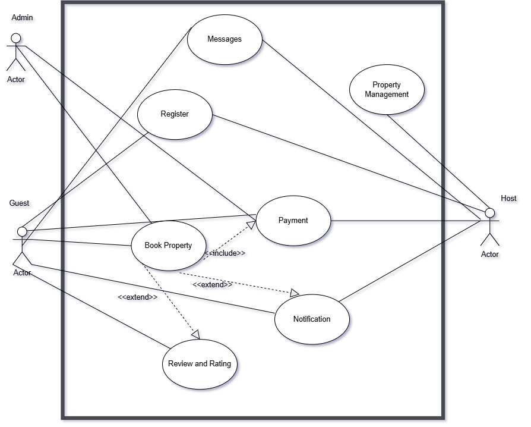

### Description of the Use Case Diagram

This diagram illustrates the interactions between three types of users (**Admin**, **Guest**, **Host**) and the core functionalities of a property rental system. The system's boundaries are clearly defined by the rectangle.

#### Actors and Their Roles:

- **Guest:**

  - Can `Register` an account.
  - Can `Book Property`.
  - Can leave a `Review and Rating`.

- **Host:**

  - Can `Register` an account.
  - Can manage `Property Management` (e.g., add/edit listings).
  - Can interact with `Messages`.
  - Interacts with the `Payment` system (likely to receive payouts).
  - Receives `Notification`.

- **Admin:**
  - Can `Register` (implies creating accounts, perhaps for others).
  - Can access `Messages`.
  - Can perform `Property Management` (likely overseeing all properties).
